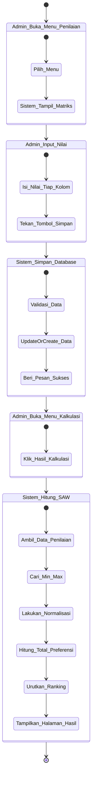

# Activity Diagram

Diagram aktivitas di bawah ini menjelaskan aliran kerja (workflow) spesifik antara aktor (Admin) dengan Sistem selama proses pengelolaan penilaian hingga tahap munculnya rekomendasi keputusan.

## Penjelasan Langkah
1. **Buka Menu Penilaian:** Admin masuk ke halaman Assessments, kemudian Sistem menampilkan grid tabel/matriks yang mempertemukan mahasiswa dengan kriteria.
2. **Input Nilai:** Admin memasukkan atau merevisi nilai yang ada pada grid, dan menekan tombol simpan.
3. **Simpan ke Database:** Sistem menangkap seluruh kumpulan (array) data masukan, kemudian menyimpannya ke tabel `assessments` melalui logika *update or create*.
4. **Buka Menu Kalkulasi:** Setelah data nilai disimpan, Admin berpindah ke menu Kalkulasi (Calculation).
5. **Hitung SAW:** Saat menu diakses, Sistem mengeksekusi algoritma *Simple Additive Weighting* pada saat itu juga (on-the-fly) lalu menampilkan hasilnya secara urut ke layar.
