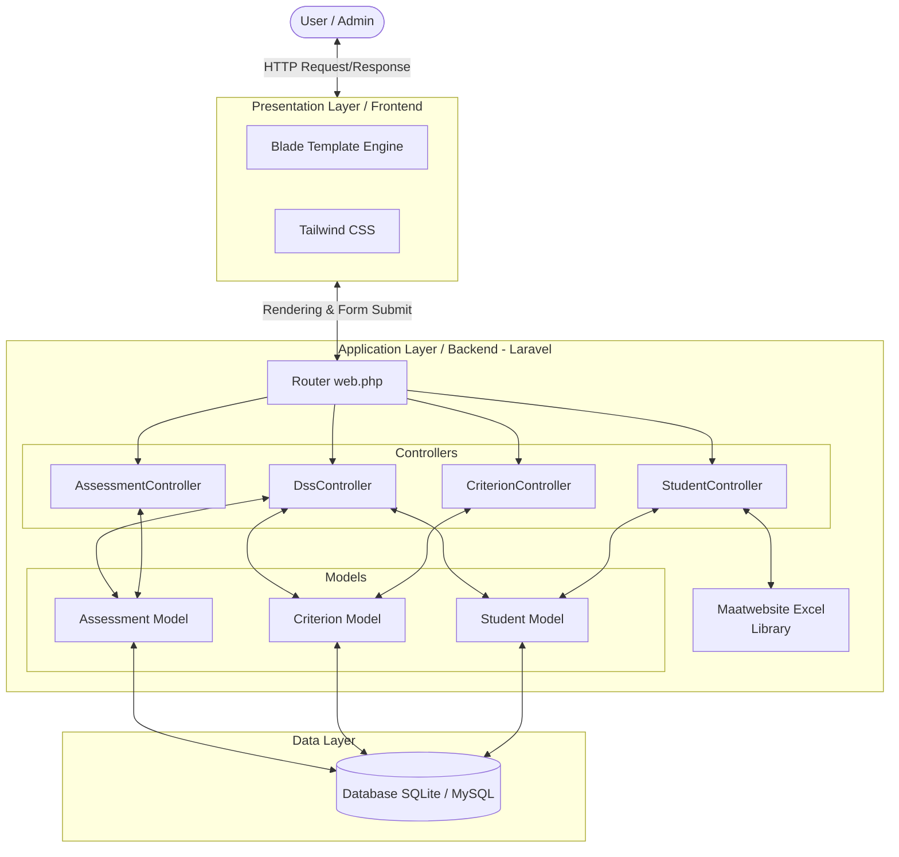

# Arsitektur Sistem

Aplikasi ini menggunakan arsitektur web modern yang mengikuti pola **MVC (Model-View-Controller)** melalui framework Laravel.

Berikut adalah diagram arsitektur sistem:

## Penjelasan Arsitektur

1. **User / Admin:** Berinteraksi dengan aplikasi melalui web browser.
2. **Frontend Layer:** Menangani antarmuka menggunakan Blade Template Engine (bawaan Laravel) yang disokong oleh styling menggunakan Tailwind CSS dan Vite untuk kompilasi aset.
3. **Backend Layer (Laravel):**
   * **Route:** `web.php` menerima permintaan HTTP dari pengguna dan mengarahkannya ke metode pengontrol yang tepat.
   * **Controllers:** Memproses logika bisnis. Contohnya, `DssController` melakukan proses kalkulasi Simple Additive Weighting (SAW) berdasarkan data.
   * **Models:** Mendefinisikan struktur entitas database, melakukan manipulasi data (Eloquent ORM), dan mengatur relasi (`Student`, `Criterion`, `Assessment`).
   * **Library Eksternal:** `Maatwebsite Excel` digunakan oleh `StudentController` untuk mengekstrak data dari file excel lalu menyimpannya melalui model.
4. **Data Layer:** Merupakan DBMS (seperti SQLite/MySQL) yang menyimpan tabel data mentah secara permanen. Model Laravel (Eloquent) berhubungan secara aktif terhadap layer ini.
