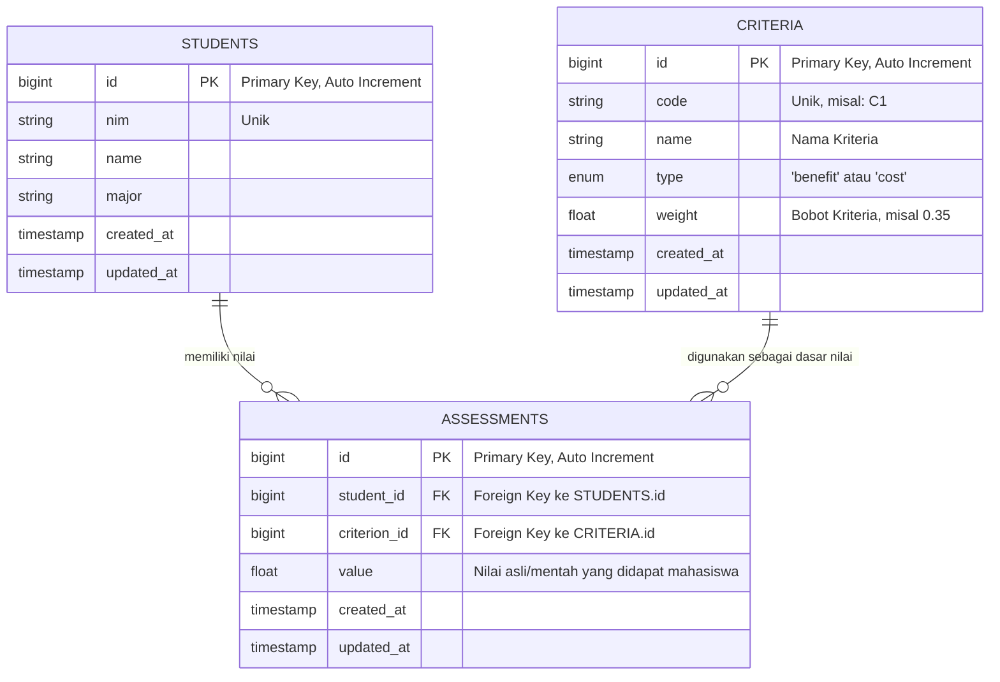

# Entity Relationship Diagram (ERD)

Berdasarkan analisis file migrasi Laravel pada direktori `database/migrations`, sistem ini menggunakan tiga tabel utama untuk menunjang proses pendukung keputusan: `students`, `criteria`, dan `assessments`.

Relasi yang terjadi adalah *Many-to-Many* antara entitas Mahasiswa dan Kriteria. Hubungan ini dipecah melalui tabel perantara (pivot table) yaitu Penilaian (`assessments`).

Berikut adalah Entity Relationship Diagram yang merepresentasikan struktur database sistem:

## Analisis Relasi
1. **Satu `STUDENT` memiliki banyak `ASSESSMENTS`:**
   Artinya, seorang mahasiswa akan memiliki banyak data nilai, yang masing-masing merupakan representasi dari kemampuannya terhadap kriteria tertentu.
2. **Satu `CRITERION` memiliki banyak `ASSESSMENTS`:**
   Artinya, sebuah kriteria akan digunakan untuk mengevaluasi banyak mahasiswa, sehingga menghasilkan banyak baris nilai untuk kriteria tersebut.
3. Tabel **`ASSESSMENTS`** menghubungkan keduanya melalui `student_id` dan `criterion_id` serta menyimpan nilai kuantitatif riil (`value`) untuk keperluan kalkulasi Algoritma SAW untuk seleksi beasiswa.
