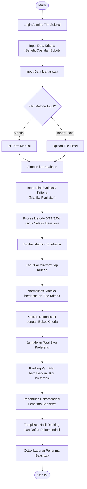

# Flowchart Proses Sistem

Flowchart di bawah ini menggambarkan alur kerja (workflow) proses utama di dalam Sistem Pendukung Keputusan Seleksi Penerima Beasiswa Akademik dari awal inisialisasi master data hingga menghasilkan laporan akhir rekomendasi.

## Deskripsi Flowchart
1. **Mulai & Login:** Admin memulai proses seleksi dengan masuk ke dalam sistem.
2. **Input Kriteria:** Sistem memerlukan kriteria (seperti IPK, Penghasilan Orang Tua) terlebih dahulu sebelum dapat dihubungkan ke penilaian.
3. **Input Mahasiswa:** Admin mengisi data calon penerima beasiswa melalui metode manual atau upload Excel.
4. **Input Penilaian:** Berbekal data mahasiswa dan kriteria, admin mengisi matriks nilai masing-masing.
5. **Proses DSS:** Perhitungan otomatis (Metode SAW) berjalan di latar belakang (Bentuk Matriks, Cari Min/Max, Normalisasi, Kali Bobot).
6. **Hasil & Rekomendasi:** Sistem memberikan urutan mahasiswa terbaik (Ranking) yang dapat menjadi acuan keputusan pihak kampus untuk menentukan siapa yang berhak menerima beasiswa.
7. **Cetak Laporan:** Laporan dapat dicetak sebagai bukti dokumentasi atau diserahkan ke pihak manajemen kampus.
