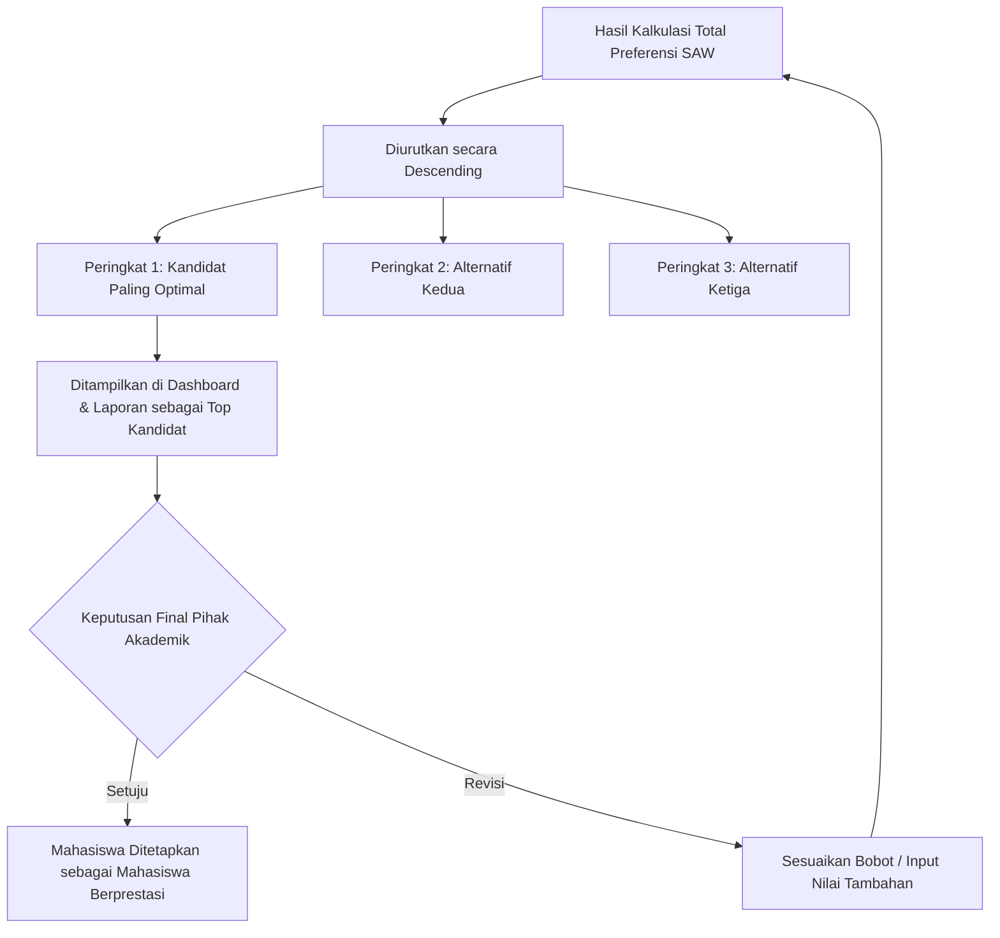

# Rekomendasi Keputusan

Sistem Pendukung Keputusan (DSS) ini dirancang sebagai alat bantu komputasi untuk merumuskan suatu "Rekomendasi Keputusan", bukan sebagai pengambil keputusan mutlak.

## Mekanisme Seleksi Mahasiswa Berprestasi
Mekanisme penentuan mahasiswa berprestasi dalam sistem ini didasarkan pada prinsip **objektivitas kuantitatif**. Seluruh faktor yang menjadi pertimbangan (Kriteria) wajib dikonversi menjadi angka mutlak.
Sistem kemudian mengumpulkan seluruh entitas mahasiswa (sebagai alternatif) dan mengadu nilai mereka secara simultan.

## Tahapan Evaluasi
Tahapan evaluasi hingga munculnya rekomendasi terbagi menjadi:
1. **Identifikasi Data Dasar:** Sistem menarik seluruh kriteria yang berstatus aktif dan mencari tahu parameter minimum dan maksimum dari seluruh mahasiswa pada kriteria tersebut.
2. **Kalkulasi Silang (Normalisasi):** Sistem tidak membandingkan nilai mentah secara langsung, melainkan "menormalisasi" nilai tersebut menjadi rasio antara 0.0 hingga 1.0. Hal ini bertujuan agar kriteria dengan satuan berbeda (misal: IPK dalam skala 4.0, sedangkan Penghasilan dalam skala Jutaan Rupiah) dapat diperbandingkan dengan adil.
3. **Penerapan Bobot Prioritas:** Pihak akademik memegang kendali penuh pada "Bobot Kriteria". Sistem akan mengalikan nilai rasio mahasiswa dengan bobot ini, menciptakan sistem preferensi bahwa "Kriteria A lebih krusial dampaknya dibanding Kriteria B".

## Perhitungan Ranking & Interpretasi Hasil
Sistem melakukan *sorting* / perangkingan *Descending* berdasarkan akumulasi skor preferensi akhir. Mahasiswa di urutan #1 adalah kandidat yang secara matematis memiliki nilai komulatif paling optimal terhadap kriteria benefit (menguntungkan) dengan menekan sekecil mungkin nilai pada kriteria cost (merugikan/biaya).

## Kesimpulan Rekomendasi
Pada akhirnya, *Dashboard* menampilkan secara ringkas "Top 3 Kandidat" beserta perolehan skornya. Pihak akademik (sebagai pengambil keputusan riil) dapat melihat ini sebagai laporan akhir yang sangat akurat secara matematis untuk meminimalisasi konflik kepentingan dan faktor subjektif lainnya.
