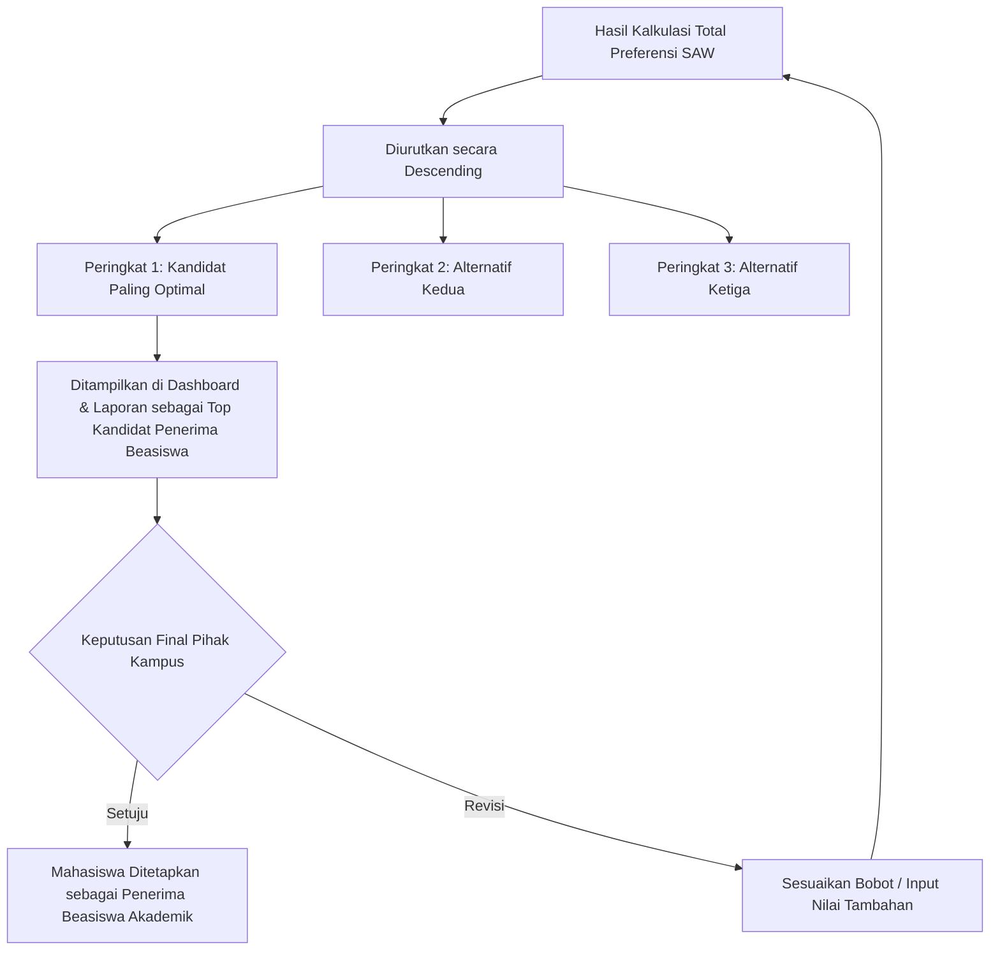

# Rekomendasi Keputusan

Sistem Pendukung Keputusan (DSS) ini dirancang sebagai alat bantu komputasi untuk merumuskan suatu "Rekomendasi Keputusan", bukan sebagai pengambil keputusan mutlak untuk penerima beasiswa akademik.

## Mekanisme Seleksi Penerima Beasiswa
Mekanisme penentuan penerima beasiswa dalam sistem ini didasarkan pada prinsip **objektivitas kuantitatif**. Seluruh faktor yang menjadi pertimbangan (Kriteria seperti IPK, Penghasilan Orang Tua) wajib dikonversi menjadi angka mutlak.
Sistem kemudian mengumpulkan seluruh entitas mahasiswa (sebagai alternatif) dan mengadu nilai mereka secara simultan.

## Input dan Tahapan Evaluasi
Tahapan evaluasi hingga munculnya rekomendasi terbagi menjadi:
1. **Input yang digunakan:** Nilai calon penerima beasiswa pada berbagai kriteria (Benefit dan Cost), beserta bobot kepentingan tiap kriteria.
2. **Identifikasi Data Dasar:** Sistem menarik seluruh kriteria yang berstatus aktif dan mencari tahu parameter minimum dan maksimum dari seluruh calon pada kriteria tersebut.
3. **Kalkulasi Silang (Normalisasi):** Sistem tidak membandingkan nilai mentah secara langsung, melainkan "menormalisasi" nilai tersebut menjadi rasio antara 0.0 hingga 1.0. Hal ini bertujuan agar kriteria dengan satuan berbeda (misal: IPK dalam skala 4.0, sedangkan Penghasilan dalam skala Jutaan Rupiah) dapat diperbandingkan dengan adil.
4. **Penerapan Bobot Prioritas:** Pihak kampus memegang kendali penuh pada "Bobot Kriteria". Sistem akan mengalikan nilai rasio calon penerima beasiswa dengan bobot ini, menciptakan sistem preferensi bahwa "Kriteria A lebih krusial dampaknya dibanding Kriteria B".

## Proses Perankingan & Interpretasi Hasil
Sistem melakukan *sorting* / perangkingan *Descending* berdasarkan akumulasi skor preferensi akhir. Calon di urutan #1 adalah kandidat yang secara matematis memiliki nilai komulatif paling optimal terhadap kriteria benefit (menguntungkan, misal IPK tinggi) dengan menekan sekecil mungkin nilai pada kriteria cost (merugikan/biaya, misal Penghasilan Orang Tua rendah).

## Kesimpulan Rekomendasi
Pada akhirnya, *Dashboard* dan *Laporan* menampilkan secara ringkas "Daftar mahasiswa yang direkomendasikan menerima beasiswa berdasarkan hasil perankingan" beserta perolehan skornya. Pihak kampus (sebagai pengambil keputusan riil) dapat melihat ini sebagai dasar yang sangat akurat secara matematis untuk meminimalisasi konflik kepentingan dan faktor subjektif lainnya dalam penyaluran beasiswa akademik.
