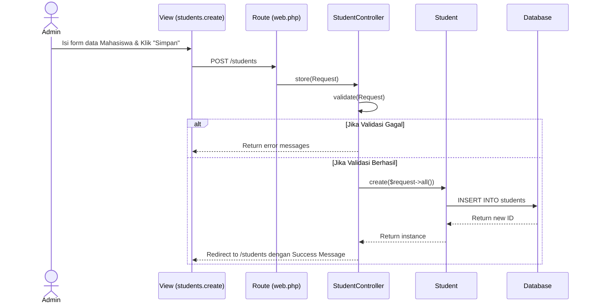
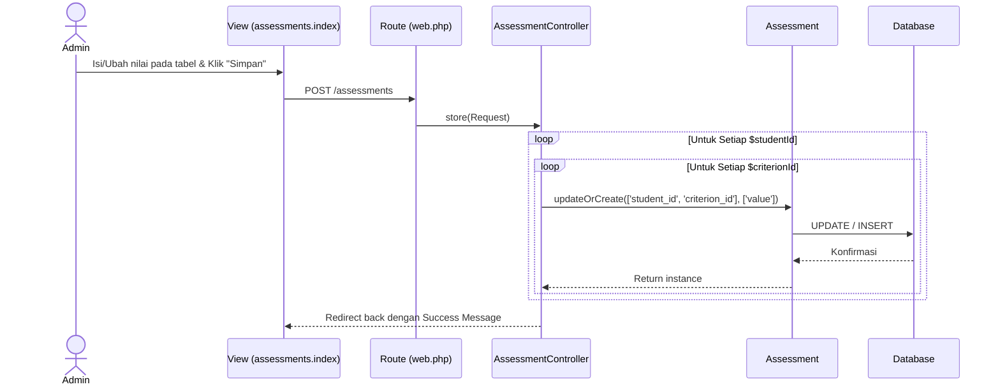
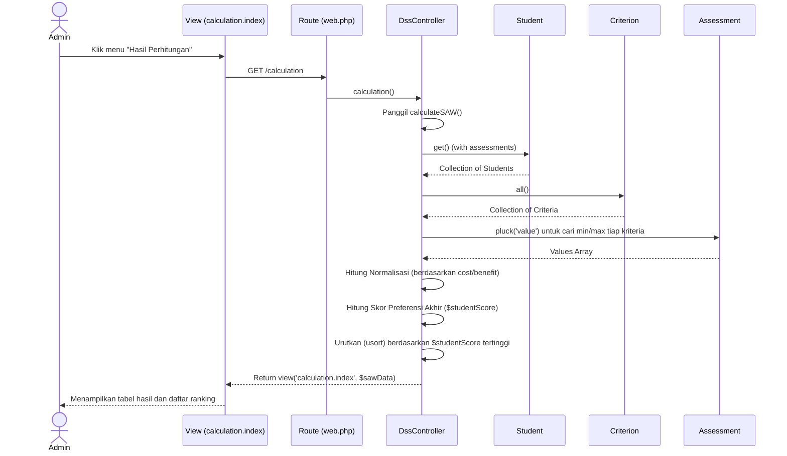

# Sequence Diagram

Dokumen ini memuat diagram sekuens (Sequence Diagram) yang memodelkan interaksi objek dari proses-proses utama yang ada di sistem berdasarkan implementasi framework Laravel.

*Catatan: Fitur Login belum terimplementasi secara spesifik pada modul yang diberikan, sehingga fokus difokuskan pada fitur inti yang sudah aktif (CRUD Data, Proses Penilaian, dan Perhitungan DSS).*

## 1. Sequence Diagram: CRUD Data Mahasiswa (Contoh: Tambah Data)

## 2. Sequence Diagram: Proses Penilaian Matriks Massal

## 3. Sequence Diagram: Proses Perhitungan DSS & Generate Ranking

