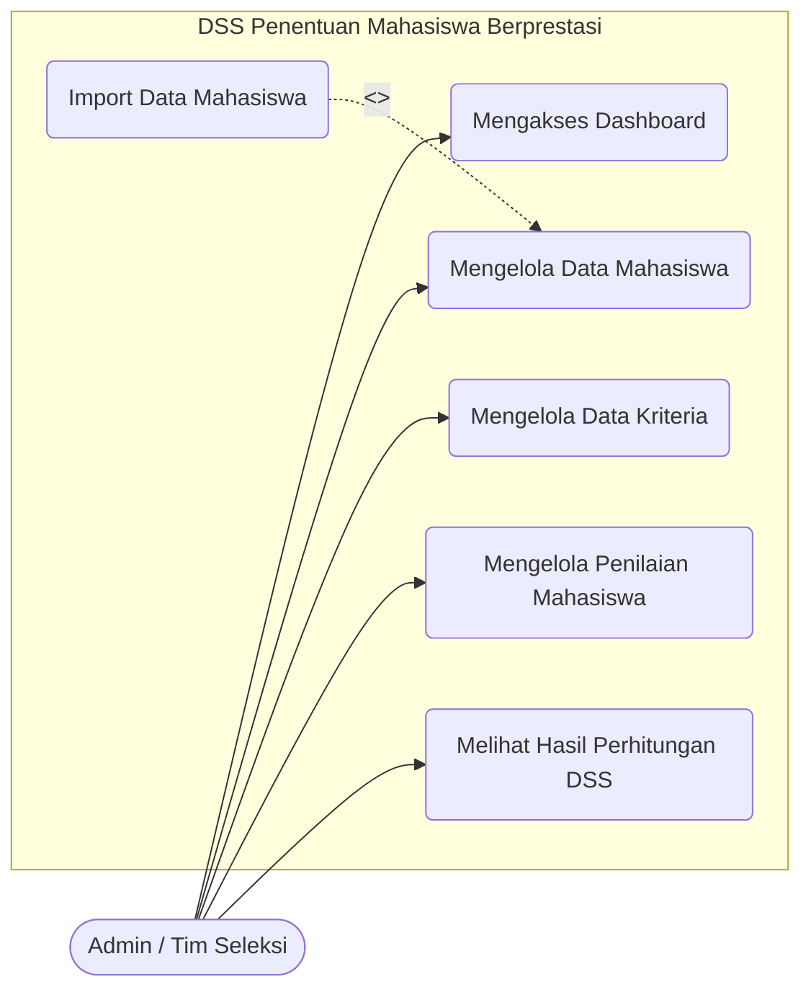

# Use Case Diagram

## 1. Daftar Actor
Berdasarkan analisis modul aplikasi, sistem saat ini beroperasi dengan asumsi **Single Role** pengguna yang bertugas sebagai pengelola utama sistem. Aktor ini dinamakan:
* **Admin / Tim Seleksi:** Pengguna yang memiliki akses penuh terhadap sistem untuk mengelola data master, mengelola penilaian, dan melihat hasil akhir rekomendasi.

## 2. Daftar Use Case
Berikut adalah Use Case yang bisa dilakukan oleh Admin:
1. Mengakses Dashboard
2. Mengelola Data Mahasiswa (CRUD dan Import)
3. Mengelola Data Kriteria (CRUD)
4. Mengelola Penilaian Mahasiswa
5. Melihat Hasil Perhitungan DSS (SAW)

## 3. Deskripsi Use Case

| Nama Use Case | Actor | Deskripsi |
| ------------- | ----- | --------- |
| **Mengakses Dashboard** | Admin | Admin masuk ke halaman utama aplikasi yang menampilkan statistik singkat data dan melihat langsung top 3 mahasiswa berprestasi hasil rekomendasi algoritma. |
| **Mengelola Data Mahasiswa** | Admin | Admin dapat menambah, mengubah, melihat detail, menghapus, atau melakukan import data mahasiswa melalui file Excel. |
| **Mengelola Data Kriteria** | Admin | Admin dapat menentukan kriteria apa saja yang digunakan untuk penilaian, mengatur bobot masing-masing, dan mengkategorikannya menjadi 'benefit' atau 'cost'. |
| **Mengelola Penilaian Mahasiswa** | Admin | Admin mengisi matriks nilai masing-masing mahasiswa terhadap setiap kriteria yang ada melalui sebuah tabel masukan. |
| **Melihat Hasil Perhitungan DSS** | Admin | Admin mengakses halaman perhitungan untuk melihat transparansi DSS, mulai dari matriks keputusan awal, hasil normalisasi nilai, hingga hasil ranking akhir lengkap dengan perolehan skor preferensi. |

## 4. Diagram Use Case (Mermaid)

